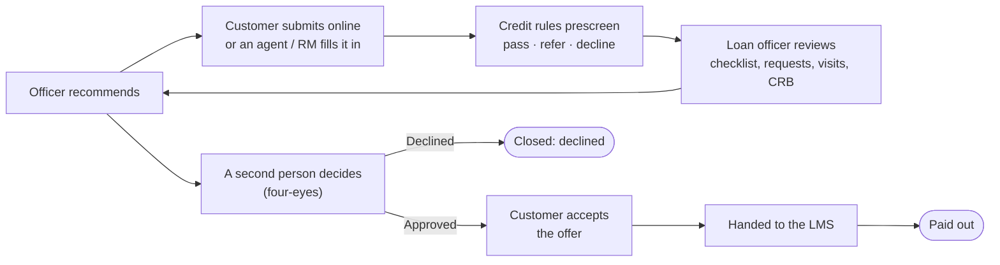
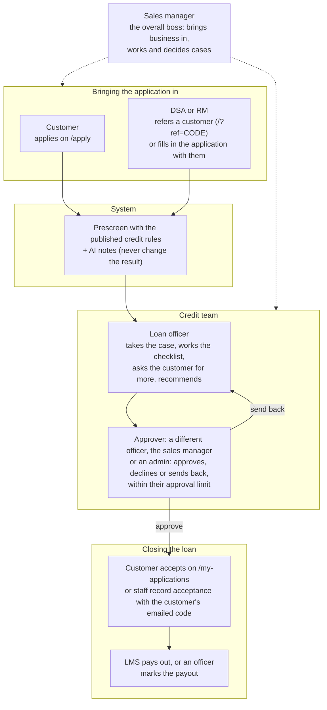
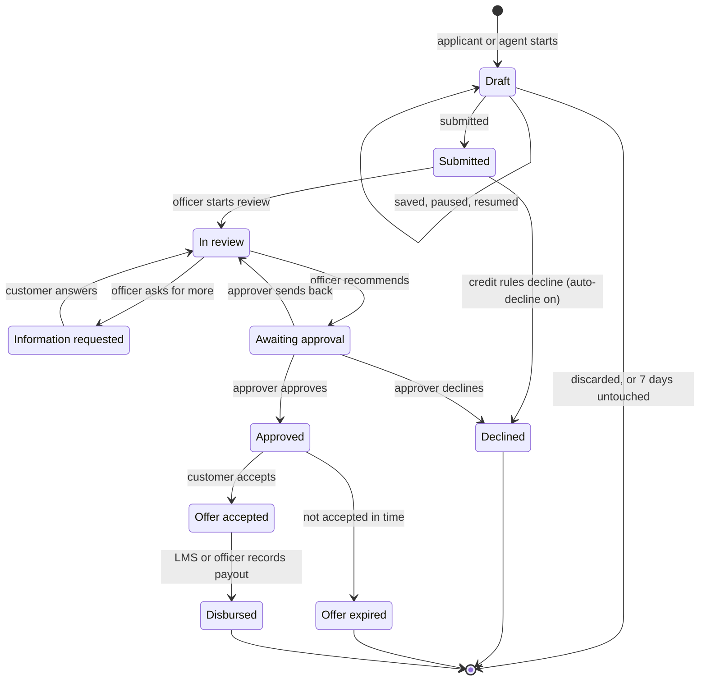
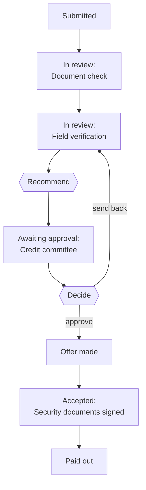
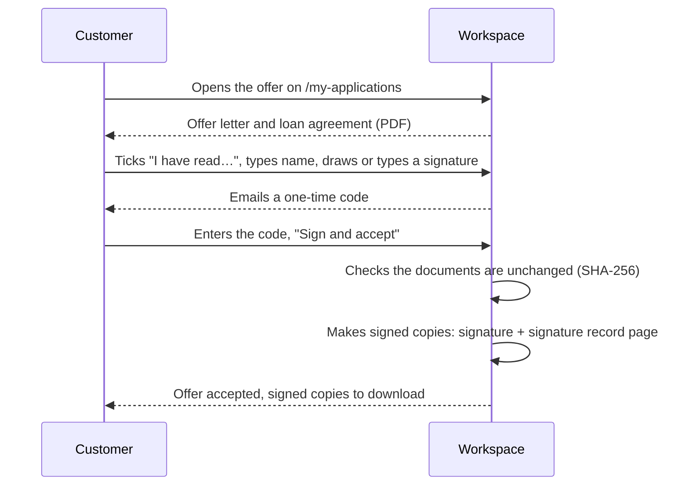
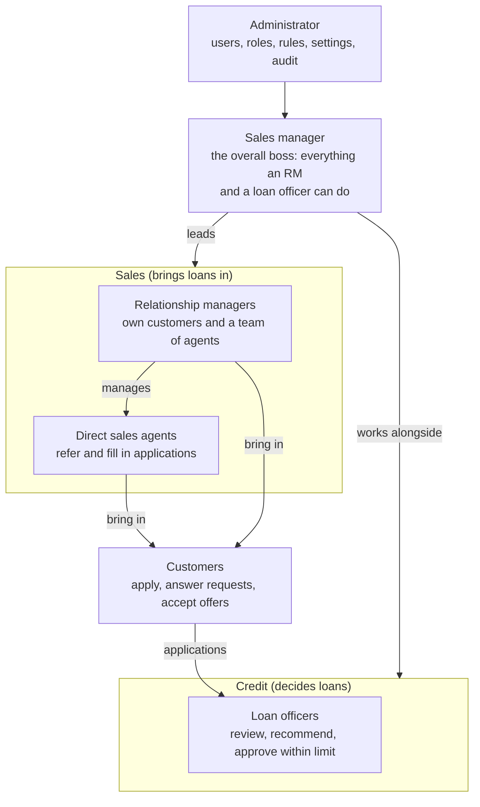

# Loan Origination

A loan origination system for personal and business loans in Zambia. Customers apply
online, or an agent fills in the application with them. The credit rules prescreen every
application. Loan officers appraise and decide, and the customer accepts the offer, all
in one workspace. Approved loans can be handed to the Frappe LMS, but everything also
works without an LMS.

It has three parts, all served from one Vite app plus Vercel functions:

| Part | URL | Who uses it |
| --- | --- | --- |
| Public site and application wizard | `/`, `/apply/:type/:step` | Applicants |
| Customer page | `/my-applications` | Applicants: follow progress, answer requests, accept offers (email-code sign-in) |
| Staff workspace | `/admin` | Admins, loan officers, sales managers, relationship managers (RMs), direct sales agents (DSAs) |

## Contents

- [Quick start](#quick-start)
- [Local development](#local-development)
- [Testing](#testing)
- [What administrators configure](#what-administrators-configure)
- [How an application moves](#how-an-application-moves)
- [Roles and what they see](#roles-and-what-they-see)
- [Project structure](#project-structure)
- [Deploying to Vercel](#deploying-to-vercel)
- [Deploying to Linux](#deploying-to-linux)
- [Limits worth knowing](#limits-worth-knowing)
- [Troubleshooting](#troubleshooting)

## Quick start

You need **Node.js 20.19+ or 22.12+** (Vite 7's minimum) and npm.

```bash
npm install
npm run dev
```

Open **<http://localhost:3000>**.

- **Applicant side:** click *Apply*, enter an email, and go through the wizard.
- **Staff side:** open **<http://localhost:3000/admin/login>** and pick a role under
  *Or try a role with sample data*. Then go to **Settings → Sample data** to fill the
  dashboards. The *Viewing as* switcher in the sidebar changes role without signing out.

You don't need a database, Redis, Blob store or mail server to start. The next section
covers what stands in for each, and how to use your own Postgres instead.

## Local development

### What runs locally, and what stands in for it

`npm run dev` serves the React app and the `api/` functions together. `vite.config.js`
mounts the handlers as dev middleware, so you don't need `vercel dev`. When a service
isn't configured, the app falls back to a local stand-in:

| Service | Configured with | Local fallback when unset |
| --- | --- | --- |
| Postgres (users, applications, rules, settings, audit log) | `DATABASE_URL` | In-process **PGlite** in `.local-pg/`, migrated automatically on startup |
| Redis (drafts, email codes, rate limits) | `KV_REST_API_URL` + `KV_REST_API_TOKEN` | JSON file `.local-kv.json` |
| Blob storage (documents) | `BLOB_READ_WRITE_TOKEN` | Files in `.local-blob/` |
| Email (codes, invitations, notifications) | `EMAIL_*` | None. Sending fails unless you set `LOS_DEV_LOG_CODES=true`, which prints codes to the terminal. |
| AI document checks and reviews | *Settings → AI document checks* (Gemini, Mistral, Claude, OpenAI, Azure OpenAI, Vertex AI, Bedrock or self-hosted, plus an optional OCR step), or the variables in `.env.example` | Off. The AI notes are hidden. |
| Frappe LMS | *Settings → LMS connection*, or `LMS_*` variables | Off. The workspace runs on its own. |
| SMS to customers | *Settings → Notifications and SMS* | Off |
| Credit bureau | `CRB_PROVIDER` | Off. `demo` gives sample scores marked as sample data. |
| Virus scanning | `CLAMAV_HOST` | Off |

All local stores are gitignored. None of the fallbacks run on Vercel: a deployment
missing a store fails with a message naming the variable to set.

### Using your own Postgres

Put the connection string in `.env.local`, then create the tables:

```bash
# .env.local
DATABASE_URL=postgres://you@localhost:5432/los_db
```

```bash
createdb los_db                                     # if it doesn't exist yet
npm run db:migrate                                  # reads DATABASE_URL from .env.local or .env
npm run create-admin -- you@example.com "Your Name" # asks for a password (12+ characters)
```

Then sign in at `/admin/login` and invite everyone else from **Team**. To hide the demo
sign-ins while working with real accounts, set `LOS_DEMO_ENABLED=false`.

### Environment files

Vite loads `.env`, then `.env.local`, then `.env.[mode]` and `.env.[mode].local`. Later
files override earlier ones. `vite.config.js` copies every value into `process.env`, so
the API handlers read them as they would on Vercel. Keep your own values in `.env.local`;
`.env.example` lists and explains every variable.

Variables the browser can read must start with `VITE_`. Never give a secret that prefix.

Useful ones for development:

```bash
LOS_DEV_LOG_CODES=true          # print email codes in the terminal when they can't be sent
LOS_ADMIN_EMAIL=you@example.com # the first admin, created on first sign-in while no staff exist
LOS_ADMIN_PASSWORD=a-long-passphrase
CRB_PROVIDER=demo               # try the credit bureau panel with sample scores
VITE_CRB_ENABLED=true           # ask applicants for credit bureau consent
```

### Everyday tasks

| Task | How |
| --- | --- |
| Change the database schema | Edit `api/_lib/db/schema.js`, run `npm run db:generate`, and commit the new file in `api/_lib/db/migrations/`. PGlite migrates on the next start; run `npm run db:migrate` for Postgres. |
| Reset local data | Stop the dev server, then `rm -rf .local-pg .local-kv.json .local-blob` (or `dropdb los_db && createdb los_db && npm run db:migrate`) |
| Sign in as a customer | Open `/my-applications`, enter the email you applied with, and read the code from the terminal (needs `LOS_DEV_LOG_CODES=true`) |
| Try an agent-assisted application | Sign in as a **DSA**, then *Applications → New application*. The customer's consent code appears in the terminal. |
| Try a referral link | Open `/?ref=DEMODSA` (or an agent's own code). The landing page names the agent and the application is credited to them. |
| Run the daily maintenance | *Admin → System health → Run now*. On Vercel it runs every morning. |
| Production build | `npm run build`, then `npm run preview` |

Only one dev server can use `.local-pg/` at a time. PGlite holds the directory open.

## Testing

| Command | What it runs |
| --- | --- |
| `npm test` | Vitest: the API and permission rules against an in-memory database, including a stand-in Frappe server for the LMS hand-off. Never reaches a real service, whatever `.env` says (`vitest.config.js`). |
| `npm run test:e2e` | Playwright: the real app in a browser, covering a referred personal loan from application to payout, a business loan, an agent-assisted application, pricing and terms changes, and every page for every role. It uses `.env.e2e`: an in-memory database, no email, no AI. Locally it drives your installed Google Chrome. |
| `npm run lint` | ESLint over `src/` |

GitHub Actions (`.github/workflows/ci.yml`) runs lint, unit tests and a build on every
push and pull request, then the browser tests. When something fails, the Playwright
report is kept as a downloadable artifact.

## What administrators configure

Everything below is set in **Settings** in the workspace. No code change or deploy is
needed, and every change is recorded in the audit log.

| Tab | What it controls |
| --- | --- |
| Credit workflow | Four-eyes approval, the target days to a decision, whether customers must accept offers (and for how many days), whether accepting means signing, automatic decline |
| Stages | The processing flow: staff names for each status, the verification checklist, and your own stages during review, before the decision and before payout (see [Configurable stages](#configurable-stages)) |
| Loan products | For each product: whether it's offered, amount and tenure limits, interest rate (flat once, or per month), facility fee (fixed or a percentage). The website, wizard and server all price with these. |
| LMS connection | The Frappe address, API key and secret (or username and password), method names, the field carrying our reference, which LMS statuses mean paid out, and when to hand over. *Test connection* checks it before you save. |
| Notifications and SMS | Staff emails, customer texts, and the SMS provider (Africa's Talking) with a test message |
| Data retention | How long declined, withdrawn and lapsed applications, paid-out loans and audit entries are kept before automatic deletion |
| Security | Roles that must use two-step sign-in |
| Branding | The product's name and logo: the site header, sign-in pages, browser tab, emails, consent wording, the authenticator app and offer documents. The logo is a PNG, JPG or WebP image of up to 1 MB. |
| Offer documents | The offer letter and loan agreement every approved loan gets: written in the workspace with fields, or your own PDF uploaded (see [Offer letter, agreement and signature](#offer-letter-agreement-and-signature)) |
| Terms and privacy | The terms and privacy notice applicants accept, edited and published as numbered versions. Each application records the versions its applicant accepted. |

Also in the workspace:

- **Roles** (`/admin/roles`): what each role can do and which applications it sees;
  add your own roles (see [Roles and what they see](#roles-and-what-they-see)).
- **Credit rules** (`/admin/rules`): edit the policy, try a draft on recent
  applications, publish a version.
- **Data requests** (`/admin/data-requests`): export or erase one person's data. Loan
  records that must be kept block erasure.
- **System health** (`/admin/health`): connections, the last maintenance run, and
  grouped server and browser errors.
- **Your profile**: turn on two-step sign-in, see your sessions, choose notification
  emails.

Credentials entered in Settings are encrypted with `LOS_SECRETS_KEY`, and the screen
never shows them again.

## How an application moves

### The journey at a glance



### Who does what at each step



### Statuses

Each application is always in one of these statuses. The customer sees a simpler label,
shown in brackets.



This shows the default settings. Also:

- **Withdrawn:** the customer can withdraw from any status up to *Approved* (turning the
  offer down counts as withdrawing).
- **Four-eyes off:** the officer's recommendation is the decision, so *In review* goes
  straight to *Approved* or *Declined*.
- **Acceptance off:** *Approved* goes straight to *Disbursed*.
- **Information requested** can also be set on a *Submitted* case. When the customer
  answers, the case returns to *In review* if an officer has it, else to *Submitted*.

| Status | Customer sees | Meaning |
| --- | --- | --- |
| Draft | (their own form) | Started, not submitted. Saved as they go; deleted after 7 days without changes |
| Submitted | Received | Waiting for a loan officer |
| In review | Being reviewed | An officer is checking details and documents |
| Information requested | We need something from you | The customer must answer on `/my-applications` |
| Awaiting approval | Being reviewed | Recommended, waiting for a second person's decision |
| Approved | Approved | An offer is waiting for the customer (14 days by default) |
| Offer accepted | Offer accepted | Ready to pay out |
| Disbursed | Paid out | Done |
| Declined, Withdrawn, Offer expired | Not approved, Withdrawn, Offer expired | Closed |

### Step by step

0. **Draft.** The wizard saves as the applicant (or an agent with them) types, so they can
   stop and carry on later: with *Save & exit*, then *Resume an application* and an
   emailed code on any device. Every draft is in the pipeline's **Draft** column for
   roles with *See unfinished applications*, within their scope. A customer applying on
   their own first agrees that staff may see the draft and contact them to help finish
   it; drafts staff started are always listed. From the draft, staff can call or email
   the customer, **email a reminder** (once a day at most), or **continue it with the
   customer**. The draft keeps the credit of whoever started it or referred it. Drafts
   untouched for 7 days are deleted.
1. **Submitted.** Online (optionally through an agent's referral link, `/?ref=CODE`) or
   filled in by an agent or RM with the customer, who confirms with an emailed code.
   The server copies the documents out of the draft and records consent (and location,
   if shared). It replies with a reference such as `LOS-2026-000123`, and a retried
   submit never files twice. Officers are notified.
2. **Prescreened.** The server computes facts from the application and its own
   document checks: debt-to-income, business age, loan-to-order, name and NRC
   mismatches, and so on. The published **credit rules** give *pass*, *refer* or
   *decline*. The result guides the officer; a *decline* only closes the case by itself
   when **auto-decline** is switched on (off by default). The AI review explains the
   result and never changes it.
3. **Reviewed.** Someone who reviews cases takes it (or is assigned it), works through the
   verification checklist, can ask the applicant for more (they answer on
   `/my-applications`), log field visits, and pull a credit report when a bureau is
   connected and the applicant consented. Officers only get cases inside their approval
   range.
4. **Recommended and decided.** The officer recommends approve or decline, with a reason
   and, for an approval, the amount, tenure and any conditions. Required checklist items
   must be done first. With **four-eyes** on (the default), someone else whose role can
   decide (another officer, the sales manager or an admin) then approves, declines or
   sends the case back. Nobody can decide a case they
   recommended or brought in, and nobody can approve an amount outside their own
   approval limit. The applicant is emailed (and texted, if SMS is on) and never sees
   the internal rationale.
5. **Offer documents made.** On approval, the workspace makes an **offer letter** and a
   **loan agreement** from the published templates, filled in with the case, and keeps
   them with it. Each records its template version and a SHA-256 fingerprint.
6. **Accepted and signed.** With acceptance on (the default), the customer reads the offer
   (it may differ from what they asked for) and both documents on `/my-applications`.
   With signing on (the default), they type their name, draw or type a signature, and
   enter a code we email them. Staff can take the same signature in person on their own
   device. Each document gets a signed copy with the signature and a signature record
   page. Unaccepted offers lapse after the set number of days (14 by default).
   Customers can withdraw at any point before acceptance.
7. **Handed to the LMS and paid out.** If an LMS is connected, the loan goes to it (on
   acceptance, or on submit if chosen). Every hand-off carries our reference, so a
   resend is matched instead of duplicated. A hand-off with no reply waits for someone
   to check the LMS. Loans the LMS reports as paid out are marked paid out here. With no
   LMS, an officer marks the payout.

Every sign-in, every change and every staff read of an application goes into the audit
log. Two people working on the same case can't overwrite each other: an action taken on
an out-of-date screen is refused with a prompt to refresh.

The switches mentioned above (four-eyes, acceptance and its expiry, auto-decline, LMS
hand-off timing) are in **Settings**. Approval limits are set per person in **Team**.

## Configurable stages

The backbone of the flow (submitted, in review, awaiting approval, approved, accepted,
paid out) is fixed, because decisions, offers and the LMS depend on it. Around it,
**Settings → Stages** lets you shape the process without code:

- **Status names.** Call *In review* "Assessment", say. Staff see the new name on the
  pipeline, lists and cases; customers keep their own plain wording.
- **The verification checklist.** Add, rename, reorder or remove items, and choose which
  are needed before approval.
- **Your own stages**, in three places:

| Where | When | Blocks until done |
| --- | --- | --- |
| During review | While the case is in review | Recommending |
| Before the decision | After the recommendation | Approving or declining |
| Before payout | After the customer accepts | Marking it paid out, and the LMS hand-off |

Each stage is done in order and can:

- require checklist items first, for example *Field verification* needing *Site visit*;
- be limited to some roles. With none ticked, anyone who can review (during review),
  decide (before the decision) or pay out (before payout) can do it, and admins always
  can;
- apply to personal loans, business loans or both;
- before the decision only: need someone other than the recommender or whoever brought
  the case in, as a credit committee would.



A stage is marked done from the case page (*Stages* panel), with an optional note, and
shows on the timeline. It can be reopened while its part of the flow is still open, which
reopens every later stage in that part too. A case sent back from the decision goes
through the *before the decision* stages again. On the pipeline, a status with stages
becomes a column per stage, plus "ready to recommend", "ready for a decision" or "ready
to pay out".

## Offer letter, agreement and signature

**Settings → Offer documents** holds the two documents every approved loan gets. For
each, choose how it is made:

- **Write it here.** Plain text, printed as typed: a blank line starts a paragraph, `## `
  a heading, `- ` a bullet. Click a field to insert it, for example `{{customer_name}}`,
  `{{amount}}`, `{{monthly_instalment}}`, `{{conditions}}`, `{{offer_expiry_date}}` or
  `{{lender_name}}`. A line whose fields are all empty is left out.
- **Upload a PDF.** Your own document. If it has fillable form fields named after the
  fields (`customer_name` or `{{customer_name}}`), they are filled for each loan and the
  form is flattened. A field named `customer_signature` is where the signature is drawn.
  A PDF with no fields we recognise is used as it is, with a page of the loan's terms
  added at the end.

Drafts can be previewed with sample values before you publish them. Only a published
version is used, and every generated document records the version it came from. The
starting wording is a placeholder: replace it with your approved text. Set the lender's
name with `LENDER_NAME`.

**Signing**, when *Accepting means signing* is on (Settings → Credit workflow):



The signature record page and the case's *Signature* panel show who signed, when (Lusaka
time), how (drawn or typed), the emailed-code confirmation, the IP address and device,
the staff member present for an in-person signing, and each document's fingerprint
before and after signing. If the acceptance itself fails, the signed copies are removed.
This is a built-in electronic signature, not a qualified digital certificate from a
certification authority. Check with your legal adviser that it meets your requirements
under the Electronic Communications and Transactions Act.

## Roles and what they see

A role is a name, a **scope** (which applications its members see) and a set of
**permissions** (what they can do). The six built-in roles below start with sensible
defaults. Administrators change them, and add their own, under **People → Roles**. A
change applies straight away to everyone with that role, without signing anyone out.

The permissions and defaults are in `src/config/roles.js`; the workspace's changes are
in the `roles` table (`api/_lib/roles.js`). Which applications a scope covers is defined
in one place, `scopeApplications` in `api/_lib/applications.js`. The server checks the
permission behind every action, whatever the role is called.

### How the roles fit together



Four-eyes still keeps selling and deciding apart for everyone, the sales manager
included: nobody can decide a case they recommended or brought in.

### What each role can do (defaults)

| Role | Sees | Can |
| --- | --- | --- |
| Admin | Everything | Everything, always: users, roles, rules, settings, audit log, data requests, system health, and every case action (within their own approval limit, if one is set). This role can't be changed, so nobody can be locked out. |
| Sales manager | All applications, all staff | Everything an RM and a loan officer can do: bring customers in, lead a team, review, recommend, approve or decline within their limit, send to the LMS, mark payouts; plus the pipeline, team performance and the credit rules (read-only) |
| Loan officer | All applications | Take, review and recommend cases; assign them; approve or decline others' recommendations within their approval limit; send to the LMS; mark payouts; read the credit rules |
| Relationship manager | Their own, plus their agents' applications | Refer customers, fill in applications, lead a team of agents, record acceptance, see the pipeline and team performance |
| Direct sales agent | Applications they brought in | Refer customers, fill in applications, record acceptance, see their pipeline |
| Customer | Their own applications | Follow progress, answer requests, accept or turn down offers, withdraw (not configurable) |

### The permissions

| Group | Permission | What it allows |
| --- | --- | --- |
| Bringing business in | Fill in applications for customers | Start and submit applications with a customer; a referral link. Applications are credited to them. |
| | Lead a team of agents | Can be an agent's manager; with the *team* scope, sees the team's applications |
| Working cases | Add notes, documents and field visits | On the cases they can see |
| | Record acceptance or withdrawal | With the code emailed to the customer |
| | Review cases | Take cases, checklist, information requests, credit checks, re-run the prescreen |
| | Assign cases to someone else | Hand a case to another reviewer |
| | Recommend approval or decline | |
| | Approve or decline | Within their approval limit (Team → their profile) |
| | Send to the LMS and record payouts | |
| | See unfinished applications | Drafts in the pipeline, within their scope; continue one with the customer or email a reminder |
| Oversight | Pipeline board, team performance, credit rules (read), team directory | |
| Administration | Edit credit rules, manage staff, change roles, change settings, audit log, data requests, system health | |

**Scopes:** *every application*; *their own and their team's* (brought in by or assigned
to them, or brought in by someone who reports to them); *only their own*.

### The sales manager

The sales manager is the overall boss of the lending operation. By default they can do
everything a relationship manager and a loan officer can, across every application:

- **Sales:** fill in applications with customers and share a referral link, lead agents,
  follow the pipeline and team performance, see the whole team directory.
- **Credit:** take and review cases, request information, run credit checks, assign cases
  to officers, recommend, and approve or decline within their approval limit. Set that
  limit on their profile in *Team*.
- **Closing:** record a customer's acceptance or withdrawal, send loans to the LMS and
  mark payouts.

They can't change settings, roles or users, or read the audit log; those stay with the
administrator. Four-eyes applies to them like anyone else.

### Adding a role

1. Open **People → Roles** and click **New role**.
2. Name it and pick a role to start from (for example *Credit analyst*, from *Loan
   officer*).
3. Untick what it shouldn't do (say, *Recommend* and *Approve or decline*), choose which
   applications it sees, and save.
4. Invite people with it from **Team**. It appears in the role list straight away.

Built-in roles can be renamed and changed, and **Reset to defaults** undoes that. A
custom role can be deleted once nobody holds it. Every change is in the audit log under
*Roles and permissions*.

### Sign-in

Staff sign in with email and password, optionally with two-step sign-in (an
authenticator app, plus one-time recovery codes). Accounts are created only by admin
invitation. Customers sign in with an emailed code. Sessions end after a few idle hours,
and immediately when an account is disabled or its role changes.

## Project structure

```text
api/
├── v1/[...path].js        # Every /api/v1 route: workspace, customer page, submit, settings
├── _handlers/             # Route handlers: auth, users, applications, workflow, settings,
│                          #   privacy, notifications, health, dashboard, audit, demo
├── _lib/
│   ├── db/                # Drizzle schema, client (Postgres or PGlite), migrations
│   ├── auth/              # Passwords, sessions, two-step sign-in (TOTP)
│   ├── applications.js    # scopeApplications: who may see which application
│   ├── workflow.js        # Appraisal and offer state machine: four-eyes, limits, versions
│   ├── prescreen/         # Facts, rulesets, prescreen runner
│   ├── lms/               # Frappe adapter (configured in Settings) and retry-safe sync
│   ├── settings.js        # Admin settings with defaults; secrets.js encrypts credentials
│   ├── products.js, legal.js, notify.js, sms.js, retention.js, maintenance.js,
│   ├── fileChecks.js, errors.js, crb/, ai/, blob.js, kv.js, email.js, …
├── draft/, otp/, ai/      # Draft save and resume, email codes, AI checks
└── cron/                  # Vercel's daily cron → _lib/maintenance.js
src/
├── pages/                 # LandingPage, MyApplicationsPage, DashboardPage.tailwind.jsx
│   └── apply/             #   the wizard's step screens and form defaults
├── admin/                 # Staff workspace: shell, pages, case/ (the case page)
├── config/                # Shared with the API: roles, products and pricing, statuses,
│                          #   credit rules, consent wording
├── components/            # Landing sections, form fields, wizard parts, ui/ primitives
├── hooks/                 # useApplicationDraft, useDocumentAnalysis, useProducts
├── services/              # API clients used by the public site
└── lib/, utils/           # Helpers: referral, assisted mode, error reporting, text rendering
scripts/                   # db-migrate.js, create-admin.js
tests/                     # Vitest suites; tests/e2e/ Playwright specs
```

Files in `src/config/` are imported by both the browser and the API, so one definition
serves both.

## Deploying to Vercel

Import the repository with the **Vite** preset (build `npm run build`, output `dist`).
The functions in `api/` deploy automatically. Set every variable for both **Production
and Preview**, since Vercel scopes variables per environment.

1. **Postgres.** Add a database (**Storage → Marketplace → Neon**, or any Postgres) and
   set `DATABASE_URL` (with Neon, the pooled `-pooler` host). Then run
   `DATABASE_URL=… npm run db:migrate` and `DATABASE_URL=… npm run create-admin -- you@example.com "Your Name"`.
   Run `db:migrate` again before deploying any change that adds a migration.
2. **Redis.** Add **Storage → Marketplace → Upstash Redis** and link it. It sets
   `KV_REST_API_URL` and `KV_REST_API_TOKEN`.
3. **Blob storage.** Add **Storage → Blob** as a **private** store and set
   `BLOB_ACCESS=private`. Documents are NRCs and bank statements; with a private store a
   file opens only through the signed-in routes.
4. **Secrets key.** Set `LOS_SECRETS_KEY` (for example `openssl rand -base64 32`).
   Credentials can't be saved in Settings without it, and signed offers are only sealed
   against later tampering when it is set.
5. **Email and links.** Set `EMAIL_HOST`, `EMAIL_PORT`, `EMAIL_USE_TLS`, `EMAIL_USE_SSL`,
   `EMAIL_HOST_USER`, `EMAIL_HOST_PASSWORD` and `DEFAULT_FROM_EMAIL`. Also set `APP_URL`
   (the base of emailed links; password links are refused in production without it) and
   `CRON_SECRET` (the daily job refuses to run without it).
6. **Then, in the workspace:** publish your real terms and privacy notice (Settings →
   Terms and privacy), set the loan products, replace the placeholder credit rule
   thresholds, and turn on two-step sign-in for admins and officers. Enter the LMS
   connection when the LMS team provides it.

Optional: an AI key, entered in Settings → AI document checks or set as `GEMINI_API_KEY`
(from a *billed* Google Cloud project; on the free tier Google may use the content) or
`MISTRAL_API_KEY` (or any other provider in that tab), `CRB_PROVIDER` once a bureau contract exists, `CLAMAV_HOST` for
virus scanning, `GEOCODER=nominatim` for the address-distance check, and
`VITE_MAP_TILE_URL` for a map tile server. `VITE_*` variables are read at build time, so
changing one needs a redeploy.

**Never set `LOS_DEMO_ENABLED=true` on a deployment with real customer data.** It lets
anyone sign in as any role.

## Deploying to Linux

To run on your own Linux server (nginx, local Postgres, systemd) instead of Vercel, see
[DEPLOY-LINUX.md](DEPLOY-LINUX.md). It includes a one-command setup script.

## Limits worth knowing

- Vercel caps function request bodies at 4.5 MB, so uploads are limited to 4 MB per file
  (3 MB for photos). Every upload's contents are checked: only real PDFs and photos are
  accepted, whatever the file is named.
- On the Hobby plan, crons run once a day at an approximate time. The job in
  `vercel.json` is daily.
- The default credit rule thresholds, such as debt-to-income above 0.4, are placeholders.
  Replace them with your policy in `/admin/rules`.
- The wizard only accepts emails ending in `.com` directly after the domain name (for
  example `name@company.com`). Addresses such as `name@company.co.zm` are rejected.

## Troubleshooting

| Symptom | Likely cause and fix |
| --- | --- |
| The app isn't at `localhost:5173` | This project uses port **3000** (`vite.config.js`). |
| "Could not send the verification email" | No working SMTP settings. Set `EMAIL_*`, or `LOS_DEV_LOG_CODES=true` locally. |
| Every sign-in fails right after setup | Check the terminal: an `LOS_ADMIN_PASSWORD` shorter than 12 characters is ignored, with a warning. |
| "Set up two-step sign-in to continue" | Your role requires it (Settings → Security). Set it up from your profile; an admin can reset it from Team if you lose your phone. |
| AI notes say "unavailable right now" | The model provider is out of credit or overloaded. Checks pause until *Try again*; the application can still be submitted. |
| Uploads or checks get 401 after the dev server restarts | The draft token was lost. The wizard gets a new one and re-uploads by itself. If it keeps happening, check free disk space. |
| The dev server won't start: database in use | Another dev server has `.local-pg/` open. Stop it, or reset local data. |
| A deployed function errors "No database/Redis/Blob store is configured" | Add that store and its variables for this environment, then redeploy. |
| "Set LOS_SECRETS_KEY…" when saving the LMS connection | Add `LOS_SECRETS_KEY` to the deployment's environment variables and redeploy. |
| A case shows "LMS receipt unconfirmed" | The LMS didn't reply. Check the LMS, then use *I've checked the LMS* on the case to record its reference or allow a resend. |
| Tests fail after a schema change | Run `npm run db:generate` and commit the migration. |
