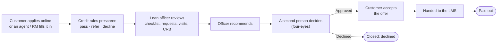
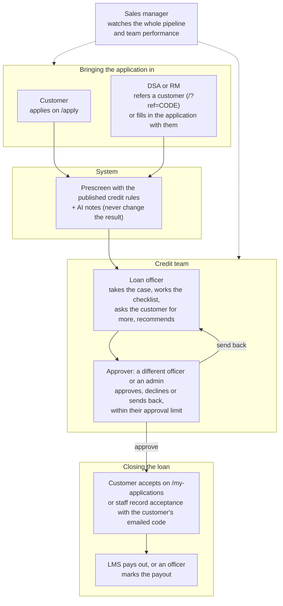
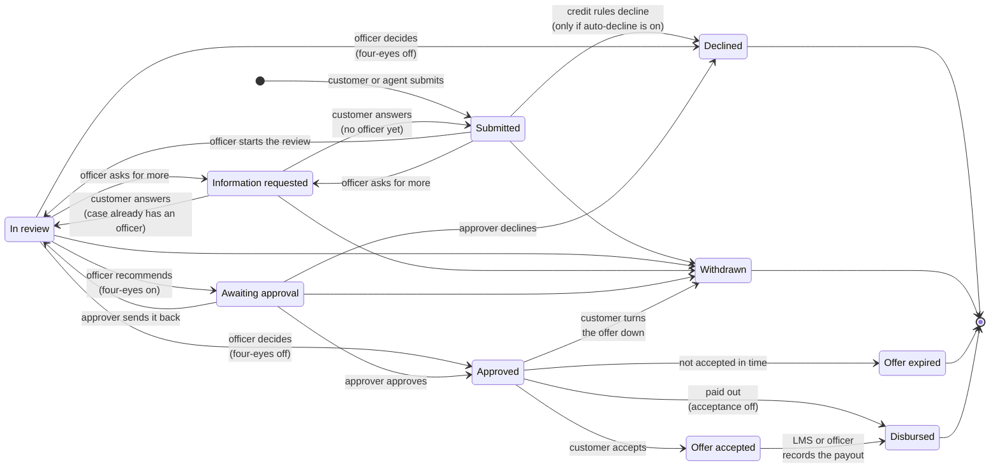
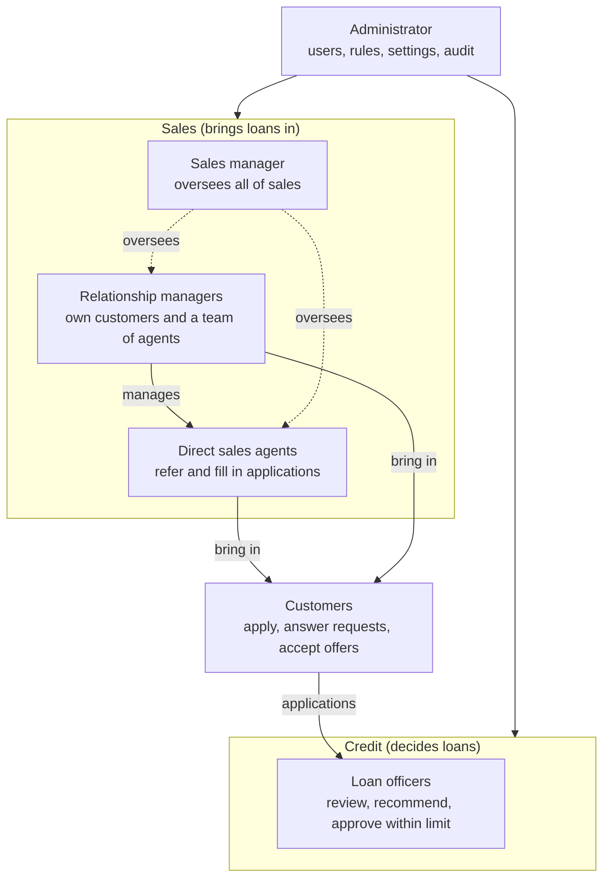

# iZyane Loan Origination

A loan origination system for personal and business loans in Zambia. Customers apply
online, or an agent fills in the application with them. The credit rules prescreen every
application. Loan officers appraise and decide, and the customer accepts the offer, all
in one workspace. Approved loans can be handed to the Frappe LMS, but everything also
works without an LMS.

It has three parts, all served from one Vite app plus Vercel functions:

| Part | URL | Who uses it |
| --- | --- | --- |
| Public site and application wizard | `/`, `/apply/:type/:step` | Applicants |
| Customer page | `/my-applications` | Applicants: follow progress, answer requests, accept offers (email-code sign-in) |
| Staff workspace | `/admin` | Admins, loan officers, sales managers, relationship managers (RMs), direct sales agents (DSAs) |

## Contents

- [Quick start](#quick-start)
- [Local development](#local-development)
- [Testing](#testing)
- [What administrators configure](#what-administrators-configure)
- [How an application moves](#how-an-application-moves)
- [Roles and what they see](#roles-and-what-they-see)
- [Project structure](#project-structure)
- [Deploying to Vercel](#deploying-to-vercel)
- [Deploying to Linux](#deploying-to-linux)
- [Limits worth knowing](#limits-worth-knowing)
- [Troubleshooting](#troubleshooting)

## Quick start

You need **Node.js 20.19+ or 22.12+** (Vite 7's minimum) and npm.

```bash
npm install
npm run dev
```

Open **<http://localhost:3000>**.

- **Applicant side:** click *Apply*, enter an email, and go through the wizard.
- **Staff side:** open **<http://localhost:3000/admin/login>** and pick a role under
  *Or try a role with sample data*. Then go to **Settings → Sample data** to fill the
  dashboards. The *Viewing as* switcher in the sidebar changes role without signing out.

You don't need a database, Redis, Blob store or mail server to start. The next section
covers what stands in for each, and how to use your own Postgres instead.

## Local development

### What runs locally, and what stands in for it

`npm run dev` serves the React app and the `api/` functions together. `vite.config.js`
mounts the handlers as dev middleware, so you don't need `vercel dev`. When a service
isn't configured, the app falls back to a local stand-in:

| Service | Configured with | Local fallback when unset |
| --- | --- | --- |
| Postgres (users, applications, rules, settings, audit log) | `DATABASE_URL` | In-process **PGlite** in `.local-pg/`, migrated automatically on startup |
| Redis (drafts, email codes, rate limits) | `KV_REST_API_URL` + `KV_REST_API_TOKEN` | JSON file `.local-kv.json` |
| Blob storage (documents) | `BLOB_READ_WRITE_TOKEN` | Files in `.local-blob/` |
| Email (codes, invitations, notifications) | `EMAIL_*` | None. Sending fails unless you set `LOS_DEV_LOG_CODES=true`, which prints codes to the terminal. |
| AI document checks and reviews | *Settings → AI document checks* (Gemini, Mistral, Claude, OpenAI, Azure OpenAI, Vertex AI, Bedrock or self-hosted, plus an optional OCR step), or the variables in `.env.example` | Off. The AI notes are hidden. |
| Frappe LMS | *Settings → LMS connection*, or `LMS_*` variables | Off. The workspace runs on its own. |
| SMS to customers | *Settings → Notifications and SMS* | Off |
| Credit bureau | `CRB_PROVIDER` | Off. `demo` gives sample scores marked as sample data. |
| Virus scanning | `CLAMAV_HOST` | Off |

All local stores are gitignored. None of the fallbacks run on Vercel: a deployment
missing a store fails with a message naming the variable to set.

### Using your own Postgres

Put the connection string in `.env.local`, then create the tables:

```bash
# .env.local
DATABASE_URL=postgres://you@localhost:5432/los_db
```

```bash
createdb los_db                                     # if it doesn't exist yet
npm run db:migrate                                  # reads DATABASE_URL from .env.local or .env
npm run create-admin -- you@example.com "Your Name" # asks for a password (12+ characters)
```

Then sign in at `/admin/login` and invite everyone else from **Team**. To hide the demo
sign-ins while working with real accounts, set `LOS_DEMO_ENABLED=false`.

### Environment files

Vite loads `.env`, then `.env.local`, then `.env.[mode]` and `.env.[mode].local`. Later
files override earlier ones. `vite.config.js` copies every value into `process.env`, so
the API handlers read them as they would on Vercel. Keep your own values in `.env.local`;
`.env.example` lists and explains every variable.

Variables the browser can read must start with `VITE_`. Never give a secret that prefix.

Useful ones for development:

```bash
LOS_DEV_LOG_CODES=true          # print email codes in the terminal when they can't be sent
LOS_ADMIN_EMAIL=you@example.com # the first admin, created on first sign-in while no staff exist
LOS_ADMIN_PASSWORD=a-long-passphrase
CRB_PROVIDER=demo               # try the credit bureau panel with sample scores
VITE_CRB_ENABLED=true           # ask applicants for credit bureau consent
```

### Everyday tasks

| Task | How |
| --- | --- |
| Change the database schema | Edit `api/_lib/db/schema.js`, run `npm run db:generate`, and commit the new file in `api/_lib/db/migrations/`. PGlite migrates on the next start; run `npm run db:migrate` for Postgres. |
| Reset local data | Stop the dev server, then `rm -rf .local-pg .local-kv.json .local-blob` (or `dropdb los_db && createdb los_db && npm run db:migrate`) |
| Sign in as a customer | Open `/my-applications`, enter the email you applied with, and read the code from the terminal (needs `LOS_DEV_LOG_CODES=true`) |
| Try an agent-assisted application | Sign in as a **DSA**, then *Applications → New application*. The customer's consent code appears in the terminal. |
| Try a referral link | Open `/?ref=DEMODSA` (or an agent's own code). The landing page names the agent and the application is credited to them. |
| Run the daily maintenance | *Admin → System health → Run now*. On Vercel it runs every morning. |
| Production build | `npm run build`, then `npm run preview` |

Only one dev server can use `.local-pg/` at a time. PGlite holds the directory open.

## Testing

| Command | What it runs |
| --- | --- |
| `npm test` | Vitest: the API and permission rules against an in-memory database, including a stand-in Frappe server for the LMS hand-off. Never reaches a real service, whatever `.env` says (`vitest.config.js`). |
| `npm run test:e2e` | Playwright: the real app in a browser, covering a referred personal loan from application to payout, a business loan, an agent-assisted application, pricing and terms changes, and every page for every role. It uses `.env.e2e`: an in-memory database, no email, no AI. Locally it drives your installed Google Chrome. |
| `npm run lint` | ESLint over `src/` |

GitHub Actions (`.github/workflows/ci.yml`) runs lint, unit tests and a build on every
push and pull request, then the browser tests. When something fails, the Playwright
report is kept as a downloadable artifact.

## What administrators configure

Everything below is set in **Settings** in the workspace. No code change or deploy is
needed, and every change is recorded in the audit log.

| Tab | What it controls |
| --- | --- |
| Credit workflow | Four-eyes approval, the officer approval limit, the target days to a decision, whether customers must accept offers (and for how many days), automatic decline |
| Loan products | For each product: whether it's offered, amount and tenure limits, interest rate (flat once, or per month), facility fee (fixed or a percentage). The website, wizard and server all price with these. |
| LMS connection | The Frappe address, API key and secret (or username and password), method names, the field carrying our reference, which LMS statuses mean paid out, and when to hand over. *Test connection* checks it before you save. |
| Notifications and SMS | Staff emails, customer texts, and the SMS provider (Africa's Talking) with a test message |
| Data retention | How long declined, withdrawn and lapsed applications, paid-out loans and audit entries are kept before automatic deletion |
| Security | Roles that must use two-step sign-in |
| Terms and privacy | The terms and privacy notice applicants accept, edited and published as numbered versions. Each application records the versions its applicant accepted. |

Also in the workspace:

- **Credit rules** (`/admin/rules`): edit the policy, try a draft on recent
  applications, publish a version.
- **Data requests** (`/admin/data-requests`): export or erase one person's data. Loan
  records that must be kept block erasure.
- **System health** (`/admin/health`): connections, the last maintenance run, and
  grouped server and browser errors.
- **Your profile**: turn on two-step sign-in, see your sessions, choose notification
  emails.

Credentials entered in Settings are encrypted with `LOS_SECRETS_KEY`, and the screen
never shows them again.

## How an application moves

### The journey at a glance



### Who does what at each step



### Statuses

Each application is always in one of these statuses. The customer sees a simpler label,
shown in brackets.



| Status | Customer sees | Meaning |
| --- | --- | --- |
| Submitted | Received | Waiting for a loan officer |
| In review | Being reviewed | An officer is checking details and documents |
| Information requested | We need something from you | The customer must answer on `/my-applications` |
| Awaiting approval | Being reviewed | Recommended, waiting for a second person's decision |
| Approved | Approved | An offer is waiting for the customer (14 days by default) |
| Offer accepted | Offer accepted | Ready to pay out |
| Disbursed | Paid out | Done |
| Declined, Withdrawn, Offer expired | Not approved, Withdrawn, Offer expired | Closed |

### Step by step

1. **Submitted.** Online (optionally through an agent's referral link, `/?ref=CODE`) or
   filled in by an agent or RM with the customer, who confirms with an emailed code.
   The server copies the documents out of the draft and records consent (and location,
   if shared). It replies with a reference such as `LOS-2026-000123`, and a retried
   submit never files twice. Officers are notified.
2. **Prescreened.** The server computes facts from the application and its own
   document checks: debt-to-income, business age, loan-to-order, name and NRC
   mismatches, and so on. The published **credit rules** give *pass*, *refer* or
   *decline*. The result guides the officer; a *decline* only closes the case by itself
   when **auto-decline** is switched on (off by default). The AI review explains the
   result and never changes it.
3. **Reviewed.** A loan officer takes the case (or is assigned it), works through the
   verification checklist, can ask the applicant for more (they answer on
   `/my-applications`), log field visits, and pull a credit report when a bureau is
   connected and the applicant consented. Officers only get cases inside their approval
   range.
4. **Recommended and decided.** The officer recommends approve or decline, with a reason
   and, for an approval, the amount, tenure and any conditions. Required checklist items
   must be done first. With **four-eyes** on (the default), a different officer or an
   admin then approves, declines or sends the case back. Nobody can decide a case they
   recommended or brought in, and nobody can approve an amount outside their own
   approval limit. The applicant is emailed (and texted, if SMS is on) and never sees
   the internal rationale.
5. **Accepted.** With acceptance on (the default), the customer reviews the offer (it
   may differ from what they asked for) and accepts it, or staff record acceptance
   using the customer's emailed code. Unaccepted offers lapse after the set number of
   days (14 by default). Customers can withdraw at any point before acceptance.
6. **Handed to the LMS and paid out.** If an LMS is connected, the loan goes to it (on
   acceptance, or on submit if chosen). Every hand-off carries our reference, so a
   resend is matched instead of duplicated. A hand-off with no reply waits for someone
   to check the LMS. Loans the LMS reports as paid out are marked paid out here. With no
   LMS, an officer marks the payout.

Every sign-in, every change and every staff read of an application goes into the audit
log. Two people working on the same case can't overwrite each other: an action taken on
an out-of-date screen is refused with a prompt to refresh.

The switches mentioned above (four-eyes, acceptance and its expiry, auto-decline, LMS
hand-off timing) are in **Settings**. Approval limits are set per person in **Team**.

## Roles and what they see

Permissions are defined in `src/config/roles.js`. Which applications each role can see
is defined in one place: `scopeApplications` in `api/_lib/applications.js`. The server
enforces both on every request.

### How the roles fit together



Sales and credit are kept apart on purpose: the people who bring a loan in can follow
it, but can't decide it.

### What each role can do

| Role | Sees | Can |
| --- | --- | --- |
| Admin | Everything | Manage users, rules, settings, audit log, data requests and system health; review and decide any case (within their own approval limit, if one is set) |
| Loan officer | All applications | Take, review and recommend cases; approve or decline others' recommendations within their approval limit; send to the LMS; mark payouts |
| Sales manager | All applications, all staff | Follow the pipeline, dashboards and team; read the credit rules; add notes, documents and field visits; record acceptance or withdrawal for a customer |
| Relationship manager | Their own, plus their agents' applications | Refer customers, fill in applications, record acceptance, view their team |
| Direct sales agent | Applications they brought in | Refer customers, fill in applications, record acceptance |
| Customer | Their own applications | Follow progress, answer requests, accept or turn down offers, withdraw |

### The sales manager

The sales manager runs the sales side: the RMs and DSAs who bring customers in. It is a
**watch and support** role, not a credit role.

**What they get:**

- **Every application.** The same full view as a loan officer, to follow how the team's
  business is moving.
- **The whole pipeline, by stage** (*Pipeline* page). Where cases are piling up, such as
  many waiting on customers under *Information requested*.
- **Team performance on the dashboard.** A leaderboard of agents and RMs by applications
  brought in, approvals, conversion rate and approved value, plus volume, channel and
  loan-type trends.
- **The team directory** (*Team* page). All staff, to see who reports to which RM. They
  can't invite or change anyone; that's the admin's job.
- **The credit rules, read-only** (*Policy rules*). They know why applications are
  referred or declined, and can coach agents on what to collect.

**What they can do on a case:** add notes, add documents collected from the customer,
log field visits, and record a customer's acceptance (with the customer's emailed code)
or withdrawal.

**What they can't do:** take, review, recommend, approve or decline cases, re-run the
prescreen, send to the LMS or mark payouts. They also can't fill in applications or
share a referral link; business is credited to the DSA or RM who brought it in. Settings,
the audit log and user management stay with the admin.

**Typical day:** check the dashboard for this week's submissions and conversion, open
the pipeline to find cases stuck on customer information, and ask the RM or agent
concerned to chase the customer.

### Relationship manager and direct sales agent

- A **DSA** brings customers in: shares their referral link or code, or fills in the
  application with the customer (who confirms with an emailed code). They see only the
  applications they brought in, can add notes and documents, and record acceptance.
- An **RM** does the same, and also manages a team of DSAs (set by the admin in *Team*).
  They see their own applications, their agents' applications, and customers assigned
  to them.

### Loan officer

Takes or is assigned cases within their approval range, works the checklist, requests
information, logs visits and credit checks, and recommends. With four-eyes on, a
colleague or admin decides. An officer can also decide a colleague's recommendation, as
long as the amount is inside their own limit.

### Sign-in

Staff sign in with email and password, optionally with two-step sign-in (an
authenticator app, plus one-time recovery codes). Accounts are created only by admin
invitation. Customers sign in with an emailed code. Sessions end after a few idle hours,
and immediately when an account is disabled or its role changes.

## Project structure

```text
api/
├── v1/[...path].js        # Every /api/v1 route: workspace, customer page, submit, settings
├── _handlers/             # Route handlers: auth, users, applications, workflow, settings,
│                          #   privacy, notifications, health, dashboard, audit, demo
├── _lib/
│   ├── db/                # Drizzle schema, client (Postgres or PGlite), migrations
│   ├── auth/              # Passwords, sessions, two-step sign-in (TOTP)
│   ├── applications.js    # scopeApplications: who may see which application
│   ├── workflow.js        # Appraisal and offer state machine: four-eyes, limits, versions
│   ├── prescreen/         # Facts, rulesets, prescreen runner
│   ├── lms/               # Frappe adapter (configured in Settings) and retry-safe sync
│   ├── settings.js        # Admin settings with defaults; secrets.js encrypts credentials
│   ├── products.js, legal.js, notify.js, sms.js, retention.js, maintenance.js,
│   ├── fileChecks.js, errors.js, crb/, ai/, blob.js, kv.js, email.js, …
├── draft/, otp/, ai/      # Draft save and resume, email codes, AI checks
└── cron/                  # Vercel's daily cron → _lib/maintenance.js
src/
├── pages/                 # LandingPage, MyApplicationsPage, DashboardPage.tailwind.jsx
│   └── apply/             #   the wizard's step screens and form defaults
├── admin/                 # Staff workspace: shell, pages, case/ (the case page)
├── config/                # Shared with the API: roles, products and pricing, statuses,
│                          #   credit rules, consent wording
├── components/            # Landing sections, form fields, wizard parts, ui/ primitives
├── hooks/                 # useApplicationDraft, useDocumentAnalysis, useProducts
├── services/              # API clients used by the public site
└── lib/, utils/           # Helpers: referral, assisted mode, error reporting, text rendering
scripts/                   # db-migrate.js, create-admin.js
tests/                     # Vitest suites; tests/e2e/ Playwright specs
```

Files in `src/config/` are imported by both the browser and the API, so one definition
serves both.

## Deploying to Vercel

Import the repository with the **Vite** preset (build `npm run build`, output `dist`).
The functions in `api/` deploy automatically. Set every variable for both **Production
and Preview**, since Vercel scopes variables per environment.

1. **Postgres.** Add a database (**Storage → Marketplace → Neon**, or any Postgres) and
   set `DATABASE_URL` (with Neon, the pooled `-pooler` host). Then run
   `DATABASE_URL=… npm run db:migrate` and `DATABASE_URL=… npm run create-admin -- you@example.com "Your Name"`.
   Run `db:migrate` again before deploying any change that adds a migration.
2. **Redis.** Add **Storage → Marketplace → Upstash Redis** and link it. It sets
   `KV_REST_API_URL` and `KV_REST_API_TOKEN`.
3. **Blob storage.** Add **Storage → Blob** as a **private** store and set
   `BLOB_ACCESS=private`. Documents are NRCs and bank statements; with a private store a
   file opens only through the signed-in routes.
4. **Secrets key.** Set `LOS_SECRETS_KEY` (for example `openssl rand -base64 32`).
   Credentials can't be saved in Settings without it.
5. **Email and links.** Set `EMAIL_HOST`, `EMAIL_PORT`, `EMAIL_USE_TLS`, `EMAIL_USE_SSL`,
   `EMAIL_HOST_USER`, `EMAIL_HOST_PASSWORD` and `DEFAULT_FROM_EMAIL`. Also set `APP_URL`
   (the base of emailed links) and `CRON_SECRET` (protects the daily job).
6. **Then, in the workspace:** publish your real terms and privacy notice (Settings →
   Terms and privacy), set the loan products, replace the placeholder credit rule
   thresholds, and turn on two-step sign-in for admins and officers. Enter the LMS
   connection when the LMS team provides it.

Optional: an AI key, entered in Settings → AI document checks or set as `GEMINI_API_KEY`
(from a *billed* Google Cloud project; on the free tier Google may use the content) or
`MISTRAL_API_KEY` (or any other provider in that tab), `CRB_PROVIDER` once a bureau contract exists, `CLAMAV_HOST` for
virus scanning, `GEOCODER=nominatim` for the address-distance check, and
`VITE_MAP_TILE_URL` for a map tile server. `VITE_*` variables are read at build time, so
changing one needs a redeploy.

**Never set `LOS_DEMO_ENABLED=true` on a deployment with real customer data.** It lets
anyone sign in as any role.

## Deploying to Linux

To run on your own Linux server (nginx, local Postgres, systemd) instead of Vercel, see
[DEPLOY-LINUX.md](DEPLOY-LINUX.md). It includes a one-command setup script.

## Limits worth knowing

- Vercel caps function request bodies at 4.5 MB, so uploads are limited to 4 MB per file
  (3 MB for photos). Every upload's contents are checked: only real PDFs and photos are
  accepted, whatever the file is named.
- On the Hobby plan, crons run once a day at an approximate time. The job in
  `vercel.json` is daily.
- The default credit rule thresholds, such as debt-to-income above 0.4, are placeholders.
  Replace them with your policy in `/admin/rules`.
- The wizard only accepts emails ending in `.com` directly after the domain name (for
  example `name@company.com`). Addresses such as `name@company.co.zm` are rejected.

## Troubleshooting

| Symptom | Likely cause and fix |
| --- | --- |
| The app isn't at `localhost:5173` | This project uses port **3000** (`vite.config.js`). |
| "Could not send the verification email" | No working SMTP settings. Set `EMAIL_*`, or `LOS_DEV_LOG_CODES=true` locally. |
| Every sign-in fails right after setup | Check the terminal: an `LOS_ADMIN_PASSWORD` shorter than 12 characters is ignored, with a warning. |
| "Set up two-step sign-in to continue" | Your role requires it (Settings → Security). Set it up from your profile; an admin can reset it from Team if you lose your phone. |
| AI notes say "unavailable right now" | The model provider is out of credit or overloaded. Checks pause until *Try again*; the application can still be submitted. |
| Uploads or checks get 401 after the dev server restarts | The draft token was lost. The wizard gets a new one and re-uploads by itself. If it keeps happening, check free disk space. |
| The dev server won't start: database in use | Another dev server has `.local-pg/` open. Stop it, or reset local data. |
| A deployed function errors "No database/Redis/Blob store is configured" | Add that store and its variables for this environment, then redeploy. |
| "Set LOS_SECRETS_KEY…" when saving the LMS connection | Add `LOS_SECRETS_KEY` to the deployment's environment variables and redeploy. |
| A case shows "LMS receipt unconfirmed" | The LMS didn't reply. Check the LMS, then use *I've checked the LMS* on the case to record its reference or allow a resend. |
| Tests fail after a schema change | Run `npm run db:generate` and commit the migration. |
